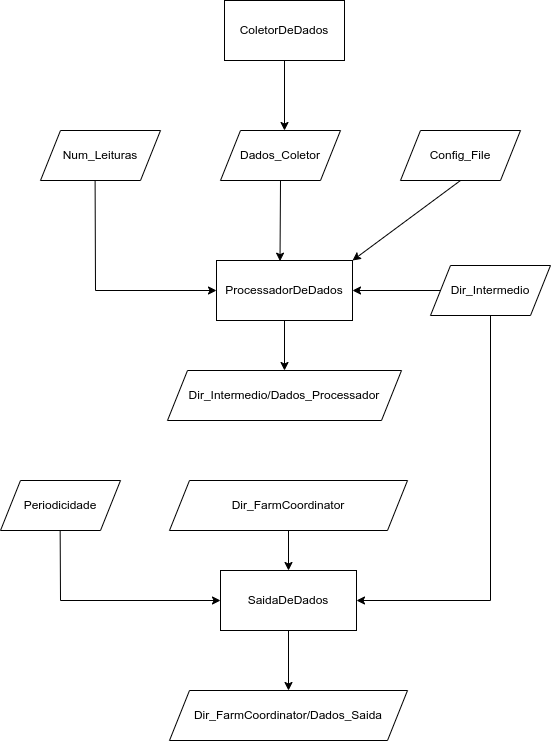

# ARQCP

#### Diagrama da arquitetura

#### Percentagem de contribuição de cada elemento do grupo no projecto

1221294: 33%
1211981: 33%
1220754: 33%

#### Funcionalidades implementadas e a repectiva percentagem funcional

Pelo que foi testado, todas as funcionalidades que foram implementadas
tem uma percentagem funcional de 100% na medida em que funcionam todas como esperado.
